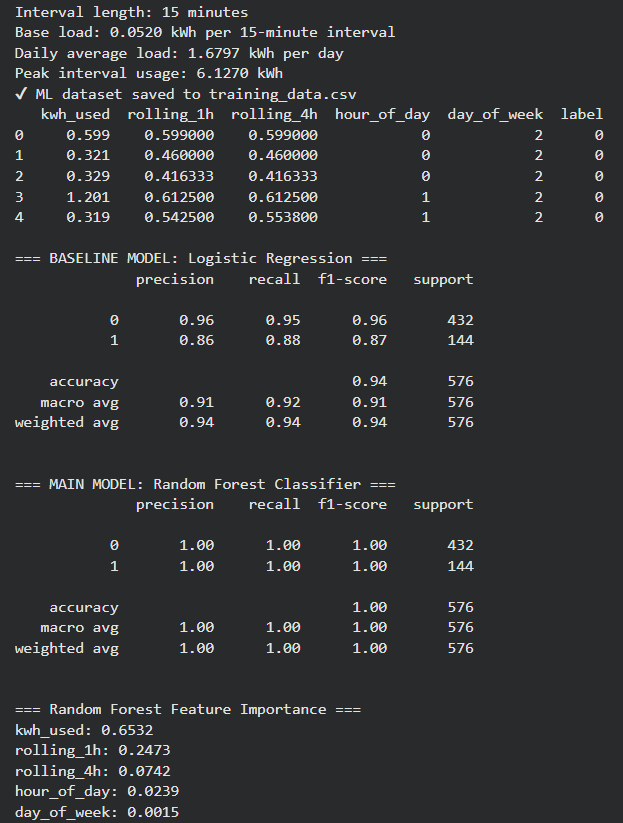

How to Run This Project in Google Colab

1. Download the two files from GitHub:

The .ipynb notebook

AMIDataExample.xlsx

2. Open Google Colab:
https://colab.research.google.com

3. Upload the notebook:
File → Upload notebook → select your .ipynb file.

4. Upload the data file:
Click the folder icon → upload button → select AMIDataExample.xlsx.

5. Run the whole project:
Runtime → Run all.

# High Load Interval Detection Using Residential AMI Data and Machine Learning

This project explores how high resolution Advanced Metering Infrastructure (AMI) data can be used to detect unusually high electricity usage at the 15 minute interval scale. The goal is to show that simple machine learning models can transform raw AMI readings into useful signals for energy conservation workflows.

---

## Overview

Utilities collect detailed 15 minute interval electricity data, but most conservation programs still rely on monthly billing histories and simple visual inspection. This creates a gap between the granularity of the data and the tools used in practice.

This project builds and evaluates a classification model that labels each 15 minute interval as either **high load** or **normal load** using only features derived from AMI data.

Models used:

- Logistic Regression, baseline linear model  
- Random Forest Classifier, nonlinear model

---

## Key Features

- Cleans and standardizes raw AMI exports  
- Generates temporal features such as rolling averages and time of day  
- Labels high load intervals using a percentile threshold  
- Compares linear and nonlinear models  
- Reports performance metrics and feature importances

---

## Dataset

The dataset includes about one month of residential AMI data recorded at 15 minute intervals.

Total observations: **about 2,880 intervals**

Each record has:

- Timestamp  
- kWh usage for that 15 minute interval  

If the real AMI file is private, this repository can include a small sample file in the `data/` folder to illustrate the structure.

---

## Methodology

1. **Data Cleaning**

   - Remove metadata and non data rows  
   - Fix inconsistent timestamps and any `"24:00"` entries  
   - Standardize the time index to a regular 15 minute spacing  

2. **Feature Engineering**

   Engineered features include:

   - `kwh_used`, interval kWh use  
   - `rolling_1h`, mean of the previous 4 intervals  
   - `rolling_4h`, mean of the previous 16 intervals  
   - `hour_of_day`  
   - `day_of_week`  

   High load intervals are defined as the top 25 percent of consumption values and labeled as the positive class.

3. **Modeling**

   - Split data into training and test sets using an 80 percent and 20 percent split  
   - Train a Logistic Regression model as a baseline  
   - Train a Random Forest classifier to capture nonlinear patterns  
   - Evaluate both models with accuracy, precision, recall, and F1 score  
   - Compute feature importance scores for the Random Forest model

---

## Results

**Logistic Regression**

- Accuracy: **0.94**  
- F1 score for high load class: **0.87**

**Random Forest Classifier**

- Accuracy: **1.00** on the test set  

**Most important features**

1. Interval kWh use  
2. One hour rolling average  
3. Four hour rolling average  

These results show that AMI only features hold strong predictive signals for identifying short term spikes related to HVAC cycles, appliances, and short duration usage patterns.

Perfect accuracy on a single household suggests excellent feature design but also highlights the need for testing across more homes to understand how well the model generalizes.

## Example Input and Output 
| Input                      | Output                    |
|----------------------------|---------------------------|
| |    |

